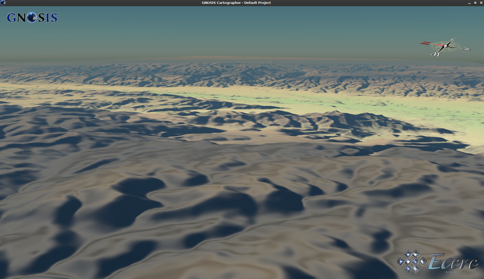
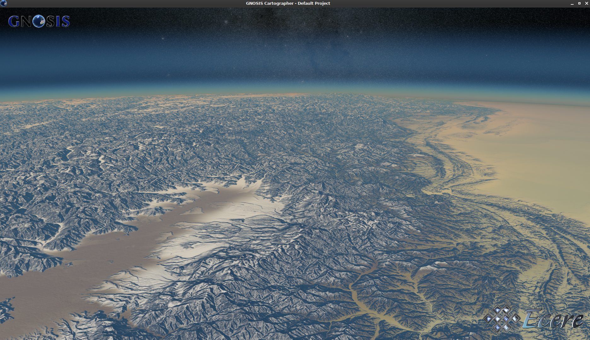
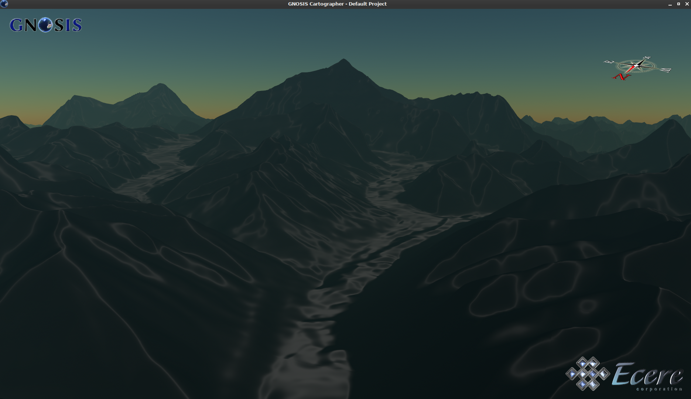
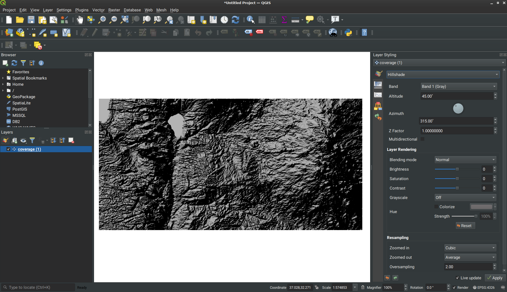

## Screenshots

This folder shows screenshots of implementations.

### Ecere

#### Accessing elevation coverage from CubeWerx server in GNOSIS Cartographer

#### Global elevation coverage (from ViewFinderPanoramas) served by GNOSIS Map Server
with ESA Gaia's Sky in colour (Gaia Data Processing and Analysis Consortium (DPAC) in background

#### Mount Everest - Global elevation coverage (from ViewFinderPanoramas) served by GNOSIS Map Server

#### Daraa elevation coverage served by GNOSIS Map Server (GeoTIFF) in QGIS

